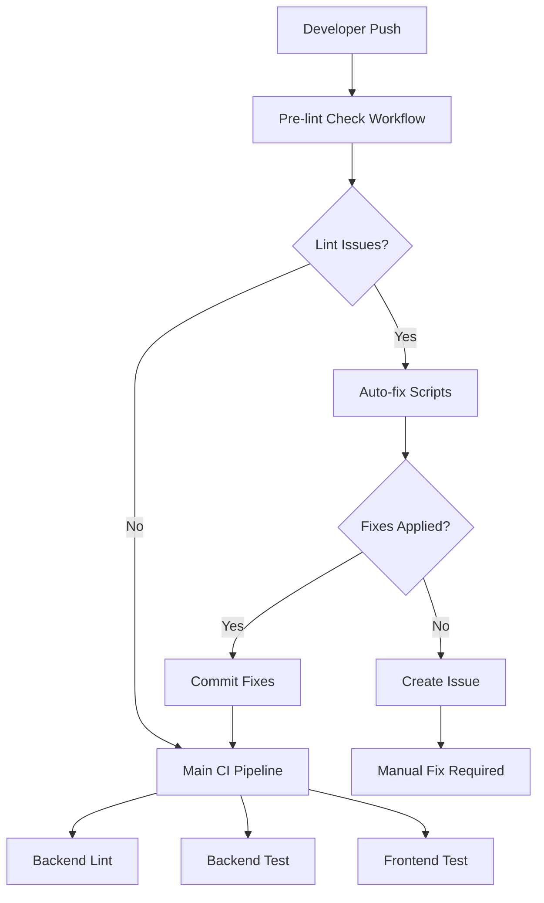

# Lint Checking and Auto-Fix System

This document describes the comprehensive lint checking and auto-fix system implemented to ensure code quality and consistency across the Asset Tag Repository.

## 🎯 Overview

The lint checking system ensures that all code meets quality standards before it reaches the main CI pipeline. It automatically detects, fixes, and verifies lint issues to prevent CI failures.

## 🏗️ System Architecture

### Components

1. **Pre-commit Hooks** - Run locally before commits
2. **Pre-lint Check Workflow** - Runs in CI before main pipeline
3. **Auto-fix Scripts** - Automatically resolve common issues
4. **Verification Scripts** - Ensure all checks pass

### Workflow Flow



## 🛠️ Setup and Usage

### Initial Setup

```bash
# Set up complete development environment
make dev-setup

# Or set up individual components
make setup-pre-commit  # Install pre-commit hooks
make install-dev       # Install development dependencies
```

### Daily Usage

```bash
# Verify all lint checks pass (same as CI)
make verify-lint

# Auto-fix lint and formatting issues
make auto-fix-lint

# Run full CI pipeline locally
make ci
```

### Pre-commit Hooks

The pre-commit hooks automatically run when you commit:

```bash
# Install pre-commit hooks
make setup-pre-commit

# Test pre-commit hooks
pre-commit run --all-files

# Update pre-commit hooks
pre-commit autoupdate
```

## 📋 Lint Checks

### Backend (Python)

- **isort** - Import sorting and formatting
- **black** - Code formatting
- **flake8** - Linting and style checking
- **mypy** - Type checking
- **bandit** - Security scanning

### Frontend (TypeScript/React)

- **ESLint** - JavaScript/TypeScript linting
- **Prettier** - Code formatting
- **TypeScript** - Type checking

## 🔧 Auto-Fix Capabilities

The system can automatically fix:

### Import Issues
- ✅ Import sorting with isort
- ✅ Import formatting and grouping
- ✅ Unused import removal

### Code Formatting
- ✅ Black code formatting
- ✅ Prettier frontend formatting
- ✅ Line length adjustments
- ✅ Trailing whitespace removal

### Common Issues
- ✅ Missing dependencies
- ✅ NPM workspace issues
- ✅ Email validator problems

## 🚨 Manual Fix Required

Some issues require manual intervention:

- ❌ Complex import errors
- ❌ Type errors that need code changes
- ❌ Security vulnerabilities
- ❌ Test failures
- ❌ Logic errors

## 📊 CI Integration

### Pre-lint Check Workflow

The `pre-lint-check.yml` workflow:

1. **Detects Changes** - Only runs on modified components
2. **Runs Verification** - Checks all lint rules
3. **Auto-fixes Issues** - Attempts to resolve problems
4. **Commits Fixes** - Automatically commits successful fixes
5. **Creates Issues** - Reports unfixable problems
6. **Comments on PRs** - Provides status updates

### Main CI Dependencies

The main CI pipeline now depends on pre-lint success:

```yaml
backend-lint:
  needs: [changes, pre-lint-check]
  if: needs.changes.outputs.backend == 'true' && needs.pre-lint-check.result == 'success'
```

## 🎛️ Configuration

### Pre-commit Configuration

Located in `.pre-commit-config.yaml`:

```yaml
repos:
  - repo: https://github.com/psf/black
    rev: 23.11.0
    hooks:
      - id: black
        args: [--line-length=88]
  
  - repo: https://github.com/pycqa/isort
    rev: 5.12.0
    hooks:
      - id: isort
        args: [--profile=black, --line-length=88]
```

### Python Configuration

Located in `asset-tag-backend/pyproject.toml`:

```toml
[tool.isort]
profile = "black"
line_length = 88
include_trailing_comma = true

[tool.black]
line-length = 88
target-version = ['py39']
```

## 🐛 Troubleshooting

### Common Issues

#### Pre-commit Hooks Not Running
```bash
# Reinstall hooks
pre-commit uninstall
pre-commit install
```

#### Auto-fix Scripts Fail
```bash
# Check Python version
python3 --version

# Install dependencies
pip install isort black flake8

# Run manually
./scripts/auto-fix-imports.sh
```

#### CI Workflow Fails
```bash
# Run local verification
make verify-lint

# Check specific component
cd asset-tag-backend && make lint
cd asset-tag-frontend && npm run lint
```

### Debug Mode

Enable debug output:

```bash
# Verbose pre-commit
pre-commit run --all-files --verbose

# Debug scripts
bash -x ./scripts/verify-lint-checks.sh
```

## 📈 Benefits

### For Developers
- ✅ **Faster Development** - Issues caught early
- ✅ **Consistent Code** - Automatic formatting
- ✅ **Less Manual Work** - Auto-fix capabilities
- ✅ **Clear Feedback** - Detailed error messages

### For CI/CD
- ✅ **Reduced Failures** - Issues fixed before CI
- ✅ **Faster Pipelines** - Fewer retries needed
- ✅ **Better Quality** - Consistent standards
- ✅ **Automated Fixes** - Less manual intervention

### For Code Quality
- ✅ **Consistent Style** - Enforced formatting
- ✅ **Import Organization** - Proper import sorting
- ✅ **Type Safety** - Type checking enabled
- ✅ **Security Scanning** - Automated security checks

## 🔄 Continuous Improvement

The system is designed to be:

- **Extensible** - Easy to add new checks
- **Configurable** - Adjustable rules and settings
- **Maintainable** - Clear scripts and documentation
- **Reliable** - Comprehensive error handling

## 📚 Additional Resources

- [Pre-commit Documentation](https://pre-commit.com/)
- [Black Documentation](https://black.readthedocs.io/)
- [isort Documentation](https://pycqa.github.io/isort/)
- [ESLint Documentation](https://eslint.org/)
- [Prettier Documentation](https://prettier.io/)

## 🤝 Contributing

To improve the lint checking system:

1. **Add New Checks** - Update `.pre-commit-config.yaml`
2. **Enhance Auto-fix** - Modify `scripts/auto-fix-imports.sh`
3. **Improve Verification** - Update `scripts/verify-lint-checks.sh`
4. **Update Documentation** - Keep this guide current

---

*This system ensures that your code is always ready for production! 🚀*
